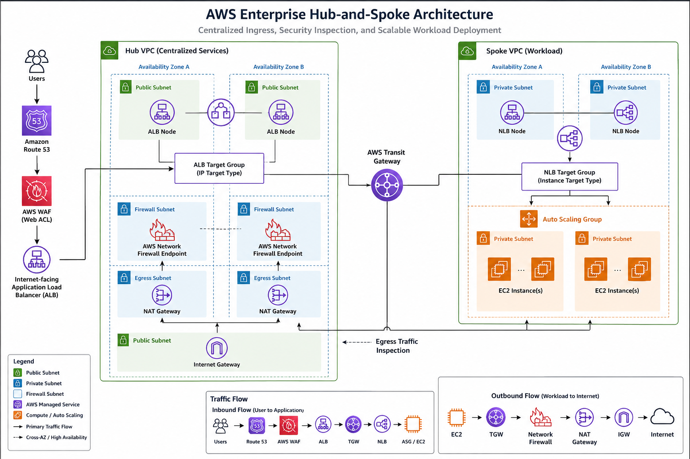

# AWS Enterprise Hub-and-Spoke Security Architecture

Enterprise-grade AWS networking project implementing a secure Hub-and-Spoke architecture using multiple AWS networking and security services.

---

# Project Overview

This project demonstrates how to build a highly available, scalable, and secure enterprise AWS network architecture.

The solution centralizes ingress traffic through a Hub VPC while hosting workloads inside a separate Spoke VPC.

Traffic is protected using AWS WAF, inspected through AWS Network Firewall, routed by AWS Transit Gateway, and distributed using both Application Load Balancer (ALB) and Network Load Balancer (NLB).

---

## Architecture

<p align="center">
  
</p>

---

# Solution Components

| Service | Purpose |
|----------|---------|
| Amazon VPC | Network isolation |
| Transit Gateway | Connect Hub and Spoke VPCs |
| AWS WAF | Layer 7 protection |
| AWS Network Firewall | Stateful traffic inspection |
| Application Load Balancer | Public HTTP entry point |
| Network Load Balancer | Private Layer 4 traffic distribution |
| Auto Scaling Group | High Availability |
| Route53 | DNS |
| Internet Gateway | Public Internet Access |
| NAT Gateway | Outbound Internet Access |
| Security Groups | Instance Security |
| Network ACLs | Subnet Security |

---

# High-Level Architecture

Internet

↓

Route53

↓

AWS WAF

↓

Internet-facing ALB (Hub)

↓

Target Group (IP)

↓

10.1.1.111

10.1.2.222

↓

Internal NLB (Spoke)

↓

Target Group (Instance)

↓

Auto Scaling Group

↓

EC2 Instances

---

# Features

- Multi-AZ Deployment
- Hub-and-Spoke Architecture
- Centralized Security
- AWS WAF Protection
- AWS Network Firewall Inspection
- Auto Scaling
- Transit Gateway Routing
- High Availability
- Layer 7 Load Balancing
- Layer 4 Load Balancing
- Enterprise Route Segmentation

---

# Repository Structure

```text
architecture/
docs/
screenshots/
terraform/
cloudformation/
scripts/
```

---

# Documentation

| Document | Description |
|-----------|-------------|
| 01-Architecture | Overall solution |
| 02-Deployment Guide | Complete deployment steps |
| 03-Hub VPC | Hub design |
| 04-Spoke VPC | Spoke design |
| 05-Transit Gateway | TGW configuration |
| 06-Route Tables | Routing explanation |
| 07-ALB | Application Load Balancer |
| 08-NLB | Network Load Balancer |
| 09-AWS WAF | WAF configuration |
| 10-Network Firewall | Firewall configuration |
| 11-Auto Scaling | ASG |
| 12-Traffic Flow | Packet flow |
| 13-Testing | Validation |
| 14-Troubleshooting | Common issues |
| 15-Cost Optimization | Pricing considerations |

---

# Traffic Flow

Client

↓

Route53

↓

AWS WAF

↓

Application Load Balancer

↓

Transit Gateway

↓

Network Load Balancer

↓

Auto Scaling Group

↓

EC2 Instance

---

# Technologies Used

- Amazon VPC
- Transit Gateway
- AWS WAF
- AWS Network Firewall
- Application Load Balancer
- Network Load Balancer
- Auto Scaling
- Route53
- EC2
- IAM
- Security Groups
- NAT Gateway
- Internet Gateway

---

# Learning Objectives

- Build enterprise Hub-and-Spoke networking
- Configure AWS Transit Gateway
- Configure centralized ingress
- Implement AWS WAF
- Deploy AWS Network Firewall
- Configure ALB to IP Target Groups
- Configure NLB to Instance Target Groups
- Deploy Auto Scaling
- Validate routing
- Test high availability

---

# License

MIT License
